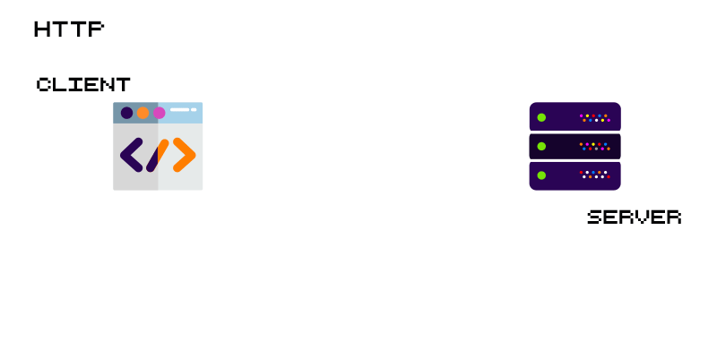

# Laborator 1 - [HTML] - Introducere

## Cuprins

- [🦉 Introducere](#-Introducere)
- [🎢 Exercitii](#-Exercitii)
- [📹 Video](#-Video)

## 🦉 Introducere

Informatii despre cum este construita o pagina web putem gasi pe [www.internetingishard.com](https://www.internetingishard.com/html-and-css/introduction).

Cand a pus bazele internetului, prin crearea [WWW](https://en.wikipedia.org/wiki/World_Wide_Web) si a [primei pagini web](http://info.cern.ch/hypertext/WWW/TheProject.html), [Tim Berners-Lee](https://en.wikipedia.org/wiki/Tim_Berners-Lee) s-a folosit de HTTP, URL si HTML.

### HTTP

HTTP sau `Hypertext Transfer Protocol` permite aplicatiilor web sa comunice intre ele si sa schimbe date de tip text, imagini, videoclipuri etc.




### URL

URL sau `Uniform Resource Locator` nu este alceva decat adresa website-ului. 

```sh
https://developer.mozilla.org
https://developer.mozilla.org/en-US/docs/Learn/
https://developer.mozilla.org/en-US/search?q=URL
```


> Mai multe informatii despre URL putem gasi pe [developer.mozilla.org](https://developer.mozilla.org/en-US/docs/Learn/Common_questions/What_is_a_URL).

### HTML

HTML sau `Hyper Text Markup Language` este limbajul de definire al continutului paginilor web, ca in exemplul urmator:

```HTML
<!DOCTYPE html>
<html lang="en">
<head>
  <meta charset="UTF-8">
  <meta name="viewport" content="width=device-width, initial-scale=1.0">
  <meta http-equiv="X-UA-Compatible" content="ie=edge">
  <title>Document</title>
</head>
<body>
  <table border="0" cellpadding="10">
      <tr>
        <td>
          
        </td>
        <td>
          <h1>Sample "Hello, World" Application</h1>
        </td>
      </tr>
    </table>
    <p>This is the home page for the Web application. </p>
</body>
</html>
```

## 🎢 Exercitii

### 💪 Exercitiul 1.1

Creati un document HTML (*index.html*) cu descrierea personala (incluzand si o poza a voastra) folosind tagurile semantice cunoscute: ````,``<article>``, ``<section>``, ``<p>``, ``<h1>``, …, ``<h6>``, … .

### 💪 Exercitiul 1.2

Creati un document HTML (*cv.html*) cu CV-ul personal care va contine cel putin 2 sectiuni (Experienta profesionala, Educatie), cuprinzand o lista cu cel putin 3 elemente (pozitii ocupate, formele de invatamant absolvite, etc.). Totodata, adaugati si lista cu abilitati pe care le aveti in sectiunea ``<aside>`` a documentului.

Exemplu de website care contine si CV-ul personal:


## 📹 Video

Video-urile de mai jos ne ajuta sa intelegem mai bine cum s-a nascut internetul si cum au evoluat browserele:

- [Ce este internetul? | Istoria internetului pe scurt](https://www.youtube.com/watch?v=ZEBlBo89QnQ).

- [Razboiul browserelor | Istoria browserelor pe scurt](https://www.youtube.com/watch?v=mrfK4DK4HW4)
