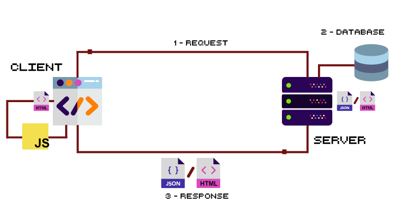

# Lab 11 - [NodeJS] - CRUD API

## Content

- [🦉 Intro](#-Intro)
- [🎢 Exercises](#-Exercises)

## 🦉 Intro

In the table below we can see the [CRUD](https://www.codecademy.com/articles/what-is-crud) (_Create_, _Read_, _Update_ and _Delete_) operations linked with the appropriate HTTP methods:

| CRUD Operation | HTTP method | URL       | URL params | Request body | Example                  |
| -------------- | ----------- | --------- | ---------- | ------------ | ------------------------ |
| _Create_       | POST        | /dogs     |            | body: {...}  | POST /dogs body: {...}   |
| _Read One_     | GET         | /dogs/:id | :id        |              | GET /dogs/123            |
| _Read All_     | GET         | /dogs     |            |              | GET /dogs                |
| _Update_       | PUT         | /dogs/:id | :id        | body: {...}  | PUT /dogs/123 body:{...} |
| _Delete_       | DELETE      | /dogs/:id | :id        |              | DELETE /dogs/123         |

## 🎢 Exercises

### 💪 Exercise 11.1

#### Project creation and installation of packages

- Create a new project using npm:

```bash
npm init
```

- Install all the [express](https://expressjs.com/), [bodyParser](https://github.com/expressjs/body-parser), [cors](https://expressjs.com/en/resources/middleware/cors.html), [uuid](https://github.com/kelektiv/node-uuid#readme), [morgan](https://github.com/expressjs/morgan) and [nodemon](https://nodemon.io/) packages by running the commands below:

```bash
npm install --save express body-parser cors uuid
```

```bash
npm install --save-dev morgan nodemon
```

```bash
npm install -g nodemon
```

- Create a `db.json` file with the following content:

```json
{
  "dogs": [
    {
      "id": "5eadf350-105e-11ea-983f-f5983827844a",
      "name": "AFFENPINSCHER",
      "img": "https://images.dog.ceo/breeds/affenpinscher/n02110627_8099.jpg"
    },
    {
      "id": "71ed9fb0-105e-11ea-983f-f5983827844a",
      "name": "AKITA",
      "img": "https://images.dog.ceo//breeds//akita//An_Akita_Inu_resting.jpg"
    },
    {
      "id": "89256140-105e-11ea-983f-f5983827844a",
      "name": "CHIHUAHUA",
      "img": "https://images.dog.ceo/breeds/chihuahua/n02085620_7613.jpg"
    },
    {
      "id": "898c1250-105e-11ea-983f-f5983827844a",
      "name": "LHASA",
      "img": "https://images.dog.ceo/breeds/lhasa/n02098413_7358.jpg"
    },
    {
      "id": "8a7fc120-105e-11ea-983f-f5983827844a",
      "name": "HOUND",
      "img": "https://images.dog.ceo/breeds/hound-afghan/n02088094_2626.jpg"
    }
  ]
}
```

- Create an `index.js` file with the content below:

```javascript
// Import packages
const express = require("express");
const morgan = require("morgan");
const bodyParser = require("body-parser");
const cors = require("cors");
const uuid = require("uuid");

const fs = require("fs");

// Application
const app = express();

// Middleware
app.use(morgan("tiny"));
app.use(bodyParser.json());
app.use(cors());

// Create
app.post("/dogs", (req, res) => {
  const dogsList = readJSONFile();
  // Fill in your code here
});

// Read One
app.get("/dogs/:id", (req, res) => {
  const dogsList = readJSONFile();
  // Fill in your code here
});

// Read All
app.get("/dogs", (req, res) => {
  const dogsList = readJSONFile();
  // Fill in your code here
});

// Update
app.put("/dogs/:id", (req, res) => {
  const dogsList = readJSONFile();
  // Fill in your code here
});

// Delete
app.delete("/dogs/:id", (req, res) => {
  const dogsList = readJSONFile();
  // Fill in your code here
});

// Reading function from db.json file
function readJSONFile() {
  return JSON.parse(fs.readFileSync("db.json"))["dogs"];
}

// Writing function from db.json file
function writeJSONFile(content) {
  fs.writeFileSync(
    "db.json",
    JSON.stringify({ dogs: content }),
    "utf8",
    err => {
      if (err) {
        console.log(err);
      }
    }
  );
}

// Starting the server
app.listen("3000", () =>
  console.log("Server started at: http://localhost:3000")
);
```

- Let's start the development server by using nodemone:

```bash
nodemon index.js
```

or by using [VS Code debugger](https://code.visualstudio.com/docs/nodejs/nodejs-debugging).

> We can compare our results with the final solution using the: [https://morning-cheddar.glitch.me/dogs](https://morning-cheddar.glitch.me/dogs) server.

### 💪 Exercise 11.2

Import the [dogs-API-postman-collection.json](https://raw.githubusercontent.com/WebToLearn/web-lab/master/doc/lab-11-en/dogs-API-postman-collection.json) collection in [Postman](https://www.postman.com/downloads/) to help you to test the server.

### 💪 Exercise 11.3

Starting from the code in the `index.js` file, create an API by solving the following exercises.

> At each step, make sure you do the actions below::
>
> - 1 - REQUEST interception
> - 2 - Interaction with the database
> - 3 - Sending RESPONSE back to the CLIENT



### 💪 Exercise 11.3.1

Save the new entities from client in the `db.json` file - POST action - _Create_.

#### 💪 Exercise 11.3.2

Send to the client a specific entity from the `db.json` file conisdering the _id_ - GET action - _Read One_

#### 💪 Exercise 11.3.3

Send back to the client all the entities from the `db.json` file - GET action - _Read All_

#### 💪 Exercise 11.3.4

Update a specific entity in the `db.json` file considering the _id_ - PUT action - _Update_.

#### 💪 Exercise 11.3.5

Delete one specific entity in the list from the `db.json` file considering the _id_ - DELETE action - _Delete_.
