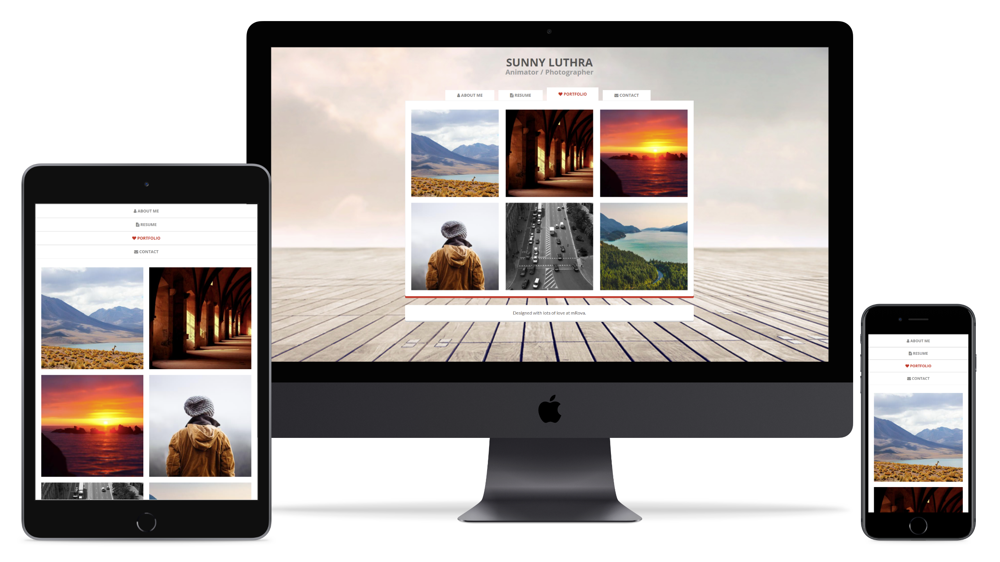
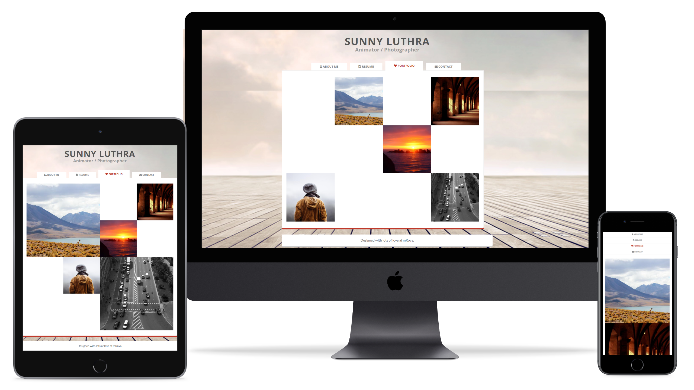

# Lab 4 - [CSS] - CSS Grid

## Content

- [🦉 Intro](#-Intro)
- [🚀 Playground](#-Playground)
- [🎢 Exercises](#-Exercises)
- [📹 Video](#-Video)

## 🦉 Intro

We can find a Complete CSS Grid guide on [CSS tricks](https://css-tricks.com/snippets/css/complete-guide-grid/).

## 🚀 Playground

[GRID GARDEN](http://cssgridgarden.com/) helps us to learn about [CSS Grid](https://developer.mozilla.org/en-US/docs/Web/CSS/CSS_Grid_Layout). Let's play!

## 🎢 Exercises

The following exercises will continue our journey to build a personal website.

### 💪 Exercise 4.1

Use the [template page](lab-3-ro) from previous exercises to create a new HTML document (_index.html_). Fill in the markup and use CSS Grid to style the page as in the design below.


> You can find Sunny's picture at: `https://raw.githubusercontent.com/WebToLearn/personal-page-css-workshop/master/img/Sunny-Luthra.png`.

### 💪 Exercise 4.2

Use [_CSS media queries_](https://web.dev/responsive-web-design-basics/#media-queries) to change how the website looks on diferent devices:

- resolution smaller than 768px - mobile
- resolution between 768px and 990px - tablet
- resolution bigger than 990px - desktop

### 🎁 Exercise 4.3

Create a ["printer friendly"](https://www.sitepoint.com/css-printer-friendly-pages/) page.

### 🎁 Exercise 4.4

Use portofolio page markup from previous exercises to create new pages (_grid-portofolio.html_, _explicitly-placed-portofolio.html_, _overlap-portofolio.html_). Also, use CSS Grid and media queries to style the pages to look like below:

#### Grid



#### Explicitly placed



#### Overlap


#### Resolution

- resolution smaller than 768px - mobile
- resolution between 768px and 990px - tablet
- resolution bigger than 990px - desktop

### 🎁 Exercise 4.5

Create a new page _lab.html_ and add the below markup and use CSS Grid to style  "The Experimental Layout Lab" like in the design below. Please choose the responsive design break point for different devices.


#### Example markup

```HTML
<header>
    <div class="header-wrapper">
      <h1>The Experimental Layout Lab</h1>
      <h1>of Jen Simmons</h1>
      <div class="demo-list">
        <h2>The Conference Talks</h2>
        <ul>
          <li>1. <a href="https://youtu.be/jreccgYLfx8">Modern Layouts: Getting Out of Our Ruts</a></li>
          <li>2. <a href="https://youtu.be/aYgMExb-mlo">Revolutionize Your Page: Real Art Direction on the Web</a>
          </li>
          <li>3. <a href="https://youtu.be/t0b3uBoDkBs">Designing with Grid</a></li>
          <li>4. <a href="https://youtu.be/jBwBACbRuGY">Everything You Know About Web Design Just Changed</a></li>
          <li>5. <a href="https://youtu.be/AMPKmh98XLY">Designing Intrinsic Layouts</a></li>
        </ul>
      </div>
      <p class="follow-links">Follow <a href="http://twitter.com/jensimmons">@jensimmons</a> on Twitter for more as
        it happens.</p>
      <div class="workshop-link">
        <ul>
          <li><a href="https://youtube.com/layoutland">Layout Land videos</a></li>
          <li><a href="http://jensimmons.com">jensimmons.com</a></li>
        </ul>
      </div>
    </div>
  </header>
```

## 📹 Video

To recap all info we have learned about CSS Grid, let's watch [Free Code Camp CSS Grid video](https://www.youtube.com/watch?v=t6CBKf8K_Ac).
