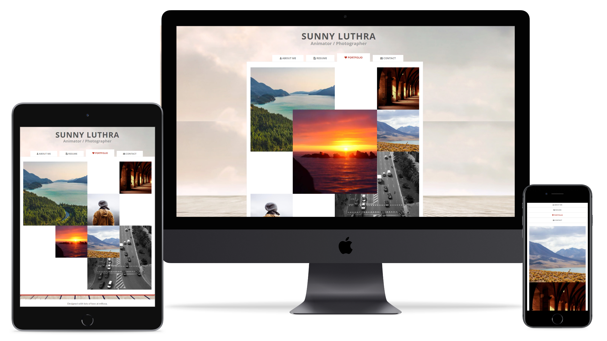
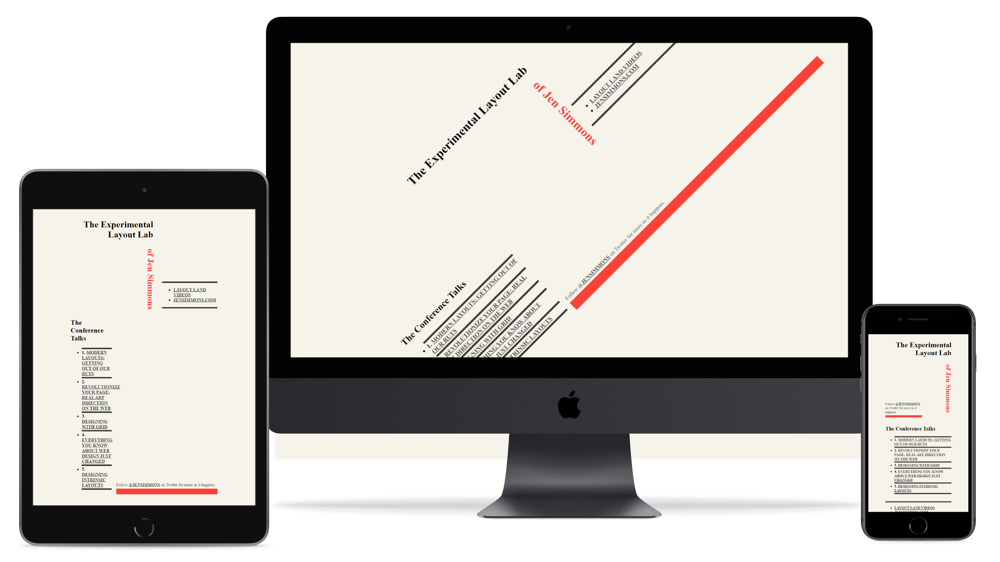

# Laborator 4 - [CSS] - CSS Grid

## Cuprins

- [🦉 Introducere](#-Introducere)
- [🚀 Playground](#-Playground)
- [🎢 Exercitii](#-Exercitii)
- [📹 Video](#-Video)

## 🦉 Introducere

Ghidul complet de folosire al CSS Grid-ului il putem gasi pe [CSS tricks](https://css-tricks.com/snippets/css/complete-guide-grid/).

## 🚀 Playground

[GRID GARDEN](http://cssgridgarden.com/) ne ajuta sa invatam CSS Grid. Hai sa ne jucam!

## 🎢 Exercitii

Exercitiile din acest laborator reprezinta o continuare a exercitiilor din laboratoarele 2 si 3.

### 💪 Exercitiul 4.1

Folositi [pagina de template](../lab-3-ro) de la exercitiile anterioare pentru a crea un nou fisier HTML (_index.html_). Completati markup-ul si stilizati-o folosind [CSS Grid](https://css-tricks.com/snippets/css/complete-guide-grid/) astfel incat sa arate precum imaginea de mai jos:


> Poza lui Sunny o puteti gasi la `https://raw.githubusercontent.com/WebToLearn/personal-page-css-workshop/master/img/Sunny-Luthra.png`.

Pentru a facilita rezolvarea acestui exercitiu, puteti consulta instructiunile din workshop-ul [CSS-Workshop-Personal-Page](https://github.com/bmnicolae/CSS-Workshop-Personal-Page/tree/master/doc/exercise-1).

### 💪 Exercitiul 4.2

Folositi [_CSS media queries_](https://web.dev/responsive-web-design-basics/#media-queries) pentru a schimba pozitionarea elementelor in functie de rezolutia dispozitivelor:

- telefon mobil - latime mai mica 768px
- tableta - latime intre 768px si 990px
- desktop - latime mai mare de 990px

### 🎁 Exercitiul 4.3

Creati o pagina cu un ["stil specific pentru printare"]((https://www.sitepoint.com/css-printer-friendly-pages/)).

### 🎁 Exercitiul 4.4

Folositi markup-ul paginii de portofoliu din exercitiile anterioare pentru a crea pagini noi (_grid-portofolio.html_, _explicitly-placed-portofolio.html_, _overlap-portofolio.html_). De asemenea, folositi CSS Grid si media queries pentru a stiliza paginile astfel incat sa arate precum in urmatoarele imagini:

#### Grid


#### Pozitionare


#### Suprapunere



#### Rezolutie

- telefon mobil - latime mai mica 768px
- tableta - latime intre 768px si 990px
- desktop - latime mai mare de 990px

### 🎁 Exercitiul 4.5

Creati o pagina noua _lab.html_, apoi adaugati markup-ul de mai jos si folositi CSS Grid pentru a o stiliza ca in design-ul aflat in continuarea exercitiului. Alegeti voi care vor fi breakpoint-urile pentru a afisa pagina pe tipuri diferite de dispozitive.



#### Examplu de markup

```HTML
<header>
    <div class="header-wrapper">
      <h1>The Experimental Layout Lab</h1>
      <h1>of Jen Simmons</h1>
      <div class="demo-list">
        <h2>The Conference Talks</h2>
        <ul>
          <li>1. <a href="https://youtu.be/jreccgYLfx8">Modern Layouts: Getting Out of Our Ruts</a></li>
          <li>2. <a href="https://youtu.be/aYgMExb-mlo">Revolutionize Your Page: Real Art Direction on the Web</a>
          </li>
          <li>3. <a href="https://youtu.be/t0b3uBoDkBs">Designing with Grid</a></li>
          <li>4. <a href="https://youtu.be/jBwBACbRuGY">Everything You Know About Web Design Just Changed</a></li>
          <li>5. <a href="https://youtu.be/AMPKmh98XLY">Designing Intrinsic Layouts</a></li>
        </ul>
      </div>
      <p class="follow-links">Follow <a href="http://twitter.com/jensimmons">@jensimmons</a> on Twitter for more as
        it happens.</p>
      <div class="workshop-link">
        <ul>
          <li><a href="https://youtube.com/layoutland">Layout Land videos</a></li>
          <li><a href="http://jensimmons.com">jensimmons.com</a></li>
        </ul>
      </div>
    </div>
  </header>
```

## 📹 Video

Daca doriti sa recapitulati ce am invatat despre CSS Grid, puteti viziona acest [video](https://www.youtube.com/watch?v=t6CBKf8K_Ac) despre CSS Grid de pe Free Code Camp. De asemenea, pentru ca am inceput sa ne facem o idee despre activitatile pe care le are un Frontend developer, puteti regasi in continuare un video care le explica mai pe larg: [Ce face un Frontend developer?](https://youtu.be/akt2gpjbiRU).
