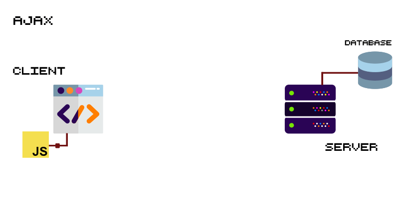

# Lab 8 - [JS] - AJAX and client side rendering - First part

## Content

- [🦉 Intro](#-Intro)
- [🎢 Exercises](#-Exercises)
- [📹 Video](#-Video)

## 🦉 Intro

### AJAX

AJAX is the short for Asynchronous JavaScript and XML and represent a set of web development techniques. AJAX involves a reduced data exchange between browser and server, so that it is not necessary to reload the whole web page each time the user makes a change to the page.



### Client side rendering

As the performance of the devices increases (computers, mobile phones, tablets and so on),the concept of rendering the content of the web page directly in the browser with the help of JavaScript appeared (not on the server side, as it happened until then). This type of application is also called *Single Page Application* because it dynamically rewrites the current page and the refresh is not needed anymore.


In the animation above it is presented how the client (browser) and the server communicate when the content is dynamically rendered in the browser:

 1. The browser makes the first request to the server to get the HTML document;

 2. The server responds with the HTML document, which only contains the links to the CSS and JavaScript files;

 3. The browser parses the HTML;

 4. The browser makes new requests to get the files linked in the HTML document;

 5. The server responds with the required CSS and JavaScript files;

 6. The browser executes the JavaScript code and creates the page layout (template);

 7. The browser makes new requests to get the JSON files with the needed information to render the content;

 8. The server makes queries to the database and creates the JSON files with the required information;

 9. The server responds to the browser with the JSON files;

 10. The browser renders the content on the page layout.

## 🎢 Exercises

### 💪  Exercise 8.1

#### My server

- Install [JSON Server](https://github.com/typicode/json-server) using the below command:

```bash
npm install -g json-server
```

- Create a `db.json` file with the following content:

```json
{
  "dogs": [
    {
      "id": 1,
      "name": "AFFENPINSCHER",
      "img": "https://images.dog.ceo/breeds/affenpinscher/n02110627_8099.jpg"
    },
    {
      "id": 2,
      "name": "AKITA",
      "img": "https://images.dog.ceo//breeds//akita//An_Akita_Inu_resting.jpg"
    },
    {
      "id": 3,
      "name": "CHIHUAHUA",
      "img": "https://images.dog.ceo/breeds/chihuahua/n02085620_7613.jpg"
    },
    {
      "id": 4,
      "name": "LHASA",
      "img": "https://images.dog.ceo/breeds/lhasa/n02098413_7358.jpg"
    },
    {
      "id": 5,
      "name": "HOUND",
      "img": "https://images.dog.ceo/breeds/hound-afghan/n02088094_2626.jpg"
    }
  ]
}
```

- Run JSON Server using the below command:

```bash
json-server --watch db.json
```

- By accessing the link [http://localhost:3000/dogs](http://localhost:3000/dogs), you will be able to see the dog list:

```json
[
  {
    "id": 1,
    "name": "AFFENPINSCHER",
    "img": "https://images.dog.ceo/breeds/affenpinscher/n02110627_8099.jpg"
  },
  {
    "id": 2,
    "name": "AKITA",
    "img": "https://images.dog.ceo//breeds//akita//An_Akita_Inu_resting.jpg"
  },
  {
    "id": 3,
    "name": "CHIHUAHUA",
    "img": "https://images.dog.ceo/breeds/chihuahua/n02085620_7613.jpg"
  },
  {
    "id": 4,
    "name": "LHASA",
    "img": "https://images.dog.ceo/breeds/lhasa/n02098413_7358.jpg"
  },
  {
    "id": 5,
    "name": "HOUND",
    "img": "https://images.dog.ceo/breeds/hound-afghan/n02088094_2626.jpg"
  }
]
```

### 💪  Exercise 8.2

#### Get all Dogs

- Create a HTML document named `index.html`.
- Create a JavaScript file called `script.js` and link it to the HTML document using the `<script>` tag at the end of it.
- Get the list of _dog_ entities from server using [fetch](https://developers.google.com/web/updates/2015/03/introduction-to-fetch) - [GET](https://spring.io/understanding/REST#get) action. While fetching the list from the server, display the message: `loading...`.
- Dynamically create and display the entity list in the page (name and image) using [createElement](https://developer.mozilla.org/en-US/docs/Web/API/Document/createElement).


## 📹 Video

[Tony Alicea](https://twitter.com/anthonypalicea) has an awesome tutorial [Don't Imitate, Understand #2 - Promises, Async, and Await](https://www.youtube.com/watch?v=fyGSyqEX2dw&t=146s) which helps us to understand how to make requests to the server.
