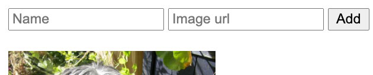

# Lab 9 - [JS] - AJAX and client side rendering - Second part

## Content

- [🦉 Intro](#-Intro)
- [🎢 Exercises](#-Exercises)

## 🦉 Intro

In the table below we can find the CRUD operations (_Create_, _Read_, _Update_ si _Delete_) associated with the appropiate HTTP methods:

| CRUD Operations | HTTP Methods | URL       | URL Parameters | Request body | Examples                 |
| -------------- | ----------- | --------- | -------------- | ------------ | ------------------------ |
| _Create_       | POST        | /dogs     |                | body: {...}  | POST /dogs body: {...}   |
| _Read One_     | GET         | /dogs/:id | :id            |              | GET /dogs/123            |
| _Read All_     | GET         | /dogs     |                |              | GET /dogs                |
| _Update_       | PUT         | /dogs/:id | :id            | body: {...}  | PUT /dogs/123 body:{...} |
| _Delete_       | DELETE      | /dogs/:id | :id            |              | DELETE /dogs/123         |

POST and PUT methods should contain `Content-Type: application/json` in the header, along with the informations from `body`.

## 🎢 Exercises

### 💪 Exercise 9.1

#### Start mock server

- Start JSON Server using the command below (*db.json* file was created in the previous lab):

```bash
json-server --watch db.json
```

- By accessing the link [http://localhost:3000/dogs/1](http://localhost:3000/dogs/1), if you started the server correctly, you will be able to see:

```json
{ "id": 1, "title": "json-server", "author": "typicode" }
```

### 💪 Exercise 9.2

Starting from the code you have written in the previous lab:

#### 💪 Exercise 9.2.1

Add in your page two [input](https://www.w3schools.com/tags/tag_input.asp) tags containing the information _name_ and _img_ to be able to modify the dog list and also make a new button named `Add`.



#### 💪 Exercise 9.2.2

Save new entities on the server - [POST](https://restfulapi.net/http-methods/#post) action - _Create_. using the inputs and the button from previous exercise.


#### 💪 Exercise 9.2.3

Update the existing entities and save them on the server - [PUT](https://restfulapi.net/http-methods/#put) action - _Update_, using the inputs and two new buttons: `Edit` and `Update`.


#### 💪 Exercise 9.2.4

Delete one of the entities from the list, but also from the server - [DELETE](https://restfulapi.net/http-methods/#delete) action - _Delete_. using a new button: `Delete`.


