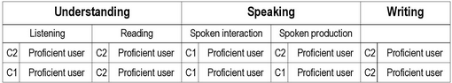

# Laborator 2 - [CSS] - Introducere

## Design website personal

## Exercitiul 2.1

Creati un document HTML (*cv.html*) cu CV-ul personal care va contine cel putin 2 sectiuni (Experienta profesionala, Educatie) cuprinzand o lista cu cel putin 3 elemente (pozitii ocupate, formele de invatamand absolvite etc.).

Stilizati acelasi document in doua moduri diferite folosind:

* atributul ``style`` pe tag-urile de HTML
* fisiere CSS

## Exercitiul 2.2

Creati si stilizati meniul de navigare dintre cele doua pagini.

## Exercitiul 2.3

Alegeti si aplicati in paginile voastre un font folosind serviul [Google Fonts](https://fonts.google.com/).

## Exercitiul 2.4

Adaugati si stilizati in pagina ce contine CV-ul tabelul de descriere a limbilor vorbite, precum in exemplul de mai jos:

