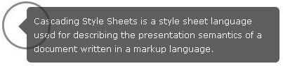

# Laborator 6 - Trucuri CSS

[GRID GARDEN](http://cssgridgarden.com/) ne ajuta sa recapitulam propietatile CSS Grid exersate in laboratorul trecut.

## Exercitiul 6.1

Intr-un document html creati designul unei sectiuni de comentarii, ca mai jos, folosind propietatile de [positionare](https://developer.mozilla.org/en-US/docs/Web/CSS/position) si [pseudoselectorii](https://www.smashingmagazine.com/2011/07/learning-to-use-the-before-and-after-pseudo-elements-in-css/) `:before` sau `:after`.

## Exercitiul 6.2

Creati layout-ul de mai jos, folosind cel putin doua metode de aliniere central-verticala:

## Exercitiul 6.3

Folosind doar HTML si CSS, creati si stilizati un meniu drop-down.
